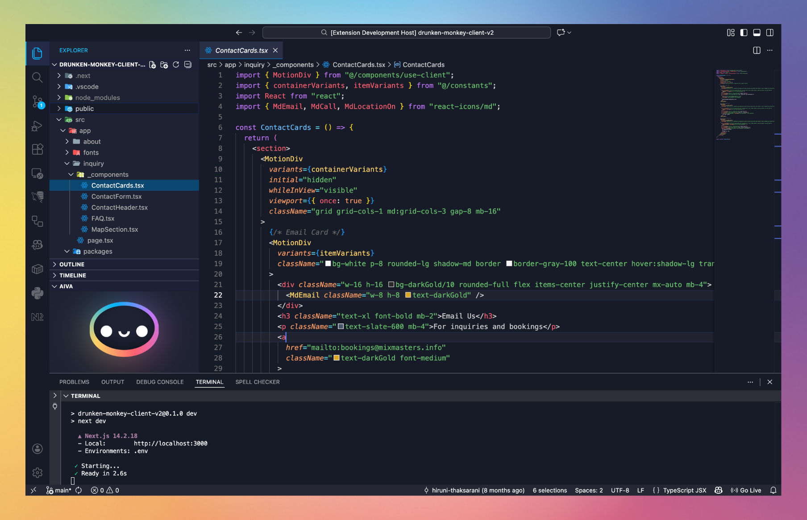

<h1> Aiva Theme for VS Code</h1>

 

A beautiful dark theme with vibrant colors and **Aiva** - your friendly coding companion that reacts to your code errors!

## Features

- 🎨 **Stunning dark theme** with carefully crafted colors
- 🤖 **Aiva mascot** that responds to your diagnostics:
  - 😊 Happy when your code is error-free
  - 😢 Sad with 1 error
  - 😞 Disappointed with 2-3 errors
  - 😱 Shocked with 4-6 errors
  - 😭 Crying with 7+ errors

## Easy Installation

1. Open the extensions sidebar on Visual Studio Code
2. Search for **Aiva**
3. Click **Install** to install it.
4. Click **Reload** to reload your editor.
5. Code/File ＞ Preferences ＞ Color Theme ＞ **Aiva**.
6. 🌟 Enjoy and [Rate five-stars](https://marketplace.visualstudio.com/items?itemName=YOUR_PUBLISHER.aiva&ssr=false#review-details).

## License

[MIT](LICENSE)
